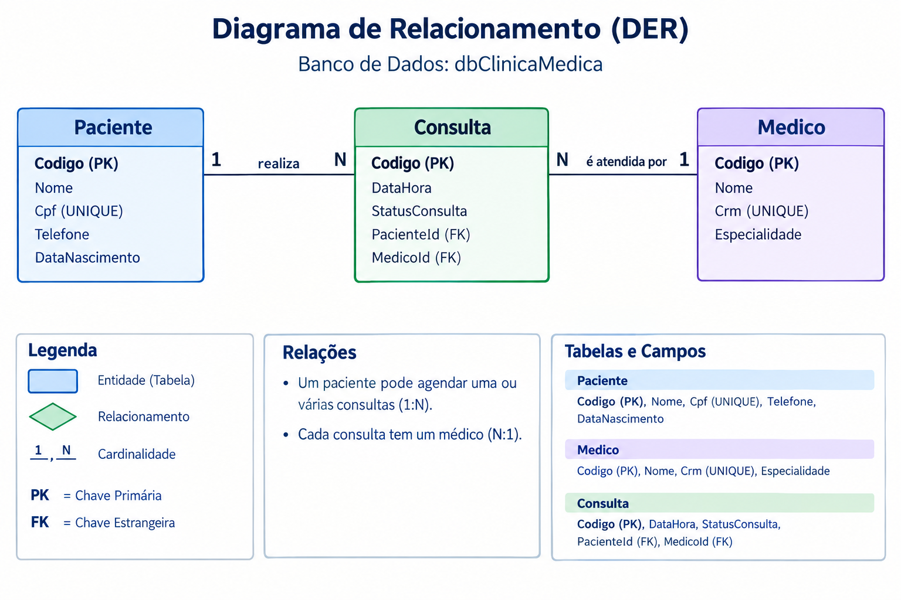
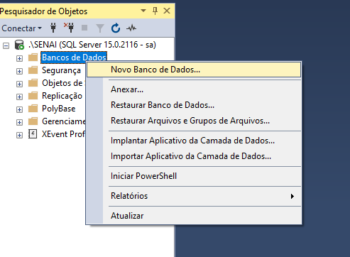
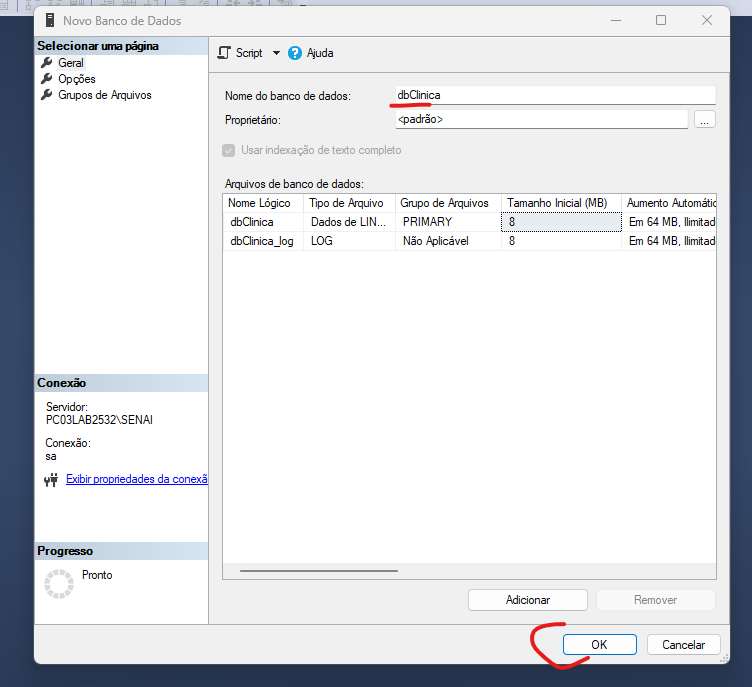
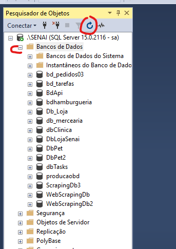
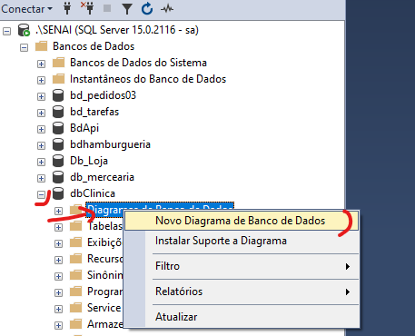

# 🚀 Guia Prático: SISTEMA CLINICA MÉDIA - AGENDAMENTO CONSULTA

## 📌 Contexto do Projeto: Sistema de Gestão da Clínica Médica "Vida & Saúde"


A clínica médica "Vida & Saúde" precisa informatizar o atendimento de consultas para melhorar a organização da agenda diária. Atualmente, os pacientes ligam ou vão presencialmente à recepção para marcar horários com médicos de diversas especialidades.

No sistema, um Paciente cadastra seus dados pessoais (Nome, CPF, Telefone e Data de Nascimento). O Médico possui seu cadastro contendo Nome, CRM e Especialidade. Uma Consulta representa o agendamento em si, onde é registrado o Paciente, o Médico responsável, a Data/Hora agendada e o Status do atendimento (Ex: Agendada, Realizada, Cancelada).

O paciente só consegue fazer agendamento  se estiver logado.  Ao abrir o sistema a primeira tela é a de login, que deve conter abaixo também uma opção para a pessoa fazer o cadastro, caso ainda não tenha.


---

## 🛠️ Pré-requisitos
- Visual Studio 2022 (com suporte ao .NET 9 instado)
- Microsoft SQL Server e SQL Server Management Studio (SSMS)

---

## 🗄️ Etapa 1: levantamento de Requisitos Funcionais

Os requisitos funcionais estão atrelada ao negócio do usuário. Um exemplo, usuário só pode fazer agendmaento se estiver logado. Cada paciente só pode fazer um agendamento naquele dia.

os requisitos funcionais são diferente dos requisitos não funcionais, pois os não funcionais refere-se, por exemplo, a definição de qual banco de dados usar, ou linguagem de programação.

Então, com base em nosso contexto podemos definir a list a seguir como nossa lista inicial de requisitos funcionais.

| ID | Requisito | Descrição |
| :--- | :--- | :--- |
| **R1** | Cadastro de Pacientes | O sistema deve permitir cadastrar, visualizar, atualizar e excluir (CRUD) os dados dos pacientes. |
| **R2** | Cadastro de Médicos | O sistema deve permitir cadastrar, visualizar, atualizar e excluir (CRUD) os dados dos médicos (incluindo CRM e Especialidade). |
| **R3** | Agendamento de Consulta | O sistema deve permitir agendar consultas vinculando obrigatoriamente 1 Paciente e 1 Médico a uma data/hora específica. |
| **R4** | Controle de Status | Toda consulta deve iniciar com o status "Agendada", permitindo alteração para "Realizada" ou "Cancelada". |
| **R5** | Integridade Relacional | Não deve ser possível excluir um paciente ou médico que já possua consultas vinculadas no histórico. |


## 🗄️ Etapa 2: DER - DIGRAMA DE ENTIDADE E RELACIONAMENTO

Com base no contexto  e requisitos podemos considerar a  imagem a seguir (DER) como ponto de partida para implementar nosso sistema.

  

ATENÇÃO
No mercado do trabalho o imporante é focar no pedido solicitado. Se um gestor pede para implementar o DER acima, foque nessa entrega. Não é interessante criar outras tabelas e campos sem antes alinhar com a sua supervisão.


## 🗄️ Etapa 3: CRIA O BANCO DE DADOS NO SQL SERVER

Para crair o banco de dados você pode fazer via Script, ou via interface do SQL Server Management.

Vamos fazer usando a proposta de intereface (cliques, tela).

1. Abra o **SQL Server Management** e coloque as credencias de login e senha
2. Ao lado esquerdo para criar o banco de dados clique com o botão direito em Banco de Dados e em seguida **Novo Banco de Dados**



3. Defina o nome do banco de dados para **dbClinica** e depois confirme clicando em **ok**



4. Para verificar se o banco foi criado, expanda a visualização de banco clicando no sinal de + de banco de dados a esquerda e se ainda não apareceu clique no botão atualizar (azul)



5. Para criar as tabelas vamos usar a opção visual **Criar Diagrama de Banco de Dados**. Clique com o botão direito nessa opção estando na visualiação do banco **dbClinica** e em seguida clique em **Novo Diagrama de Banco de Dados**




```sql
CREATE DATABASE dbTasksZero;
GO
USE dbTasksZero;
GO

-- Tabela Funcionario
CREATE TABLE Funcionario (
    Codigo INT IDENTITY(1,1) PRIMARY KEY,
    Nome VARCHAR(100) NOT NULL,
    Cargo VARCHAR(50) NOT NULL
);
GO

-- Tabela Tarefa
CREATE TABLE Tarefa (
    Codigo INT IDENTITY(1,1) PRIMARY KEY,
    Descricao VARCHAR(200) NOT NULL,
    DataPlanejada DATETIME NOT NULL,
    DataIniciada DATETIME NULL,
    DataFinalizada DATETIME NULL,
    DataCancelada DATETIME NULL,
    StatusTarefa VARCHAR(30) NOT NULL,
    Prazo VARCHAR(20) NOT NULL,
    FuncionarioId INT NOT NULL,
    CONSTRAINT FK_Tarefa_Funcionario FOREIGN KEY (FuncionarioId) 
        REFERENCES Funcionario(Codigo)
);
GO

-- Inserindo Dados Iniciais para Teste
INSERT INTO Funcionario (Nome, Cargo) VALUES 
('Carlos Silva', 'Desenvolvedor Senior'),
('Ana Oliveira', 'Analista de QA'),
('Roberto Santos', 'Gerente de Projetos');

INSERT INTO Tarefa (Descricao, DataPlanejada, DataIniciada, DataFinalizada, DataCancelada, StatusTarefa, Prazo, FuncionarioId) VALUES 
('Criar tela de Login', '2026-08-10', '2026-08-01', NULL, NULL, 'Em Andamento', 'Em dia', 1),
('Homologar Release 1.0', '2026-08-05', NULL, NULL, NULL, 'Pendente', 'Em atraso', 2);
GO
```

## 📁 Etapa 2: Criação do Projeto no Visual Studio

- Abre o Visual Studio.

- Clique em Criar um novo projeto.

- Selecione o modelo Web do ASP.NET Core (Model-View-Controller) e clique em Próximo.

- Defina o nome da solução (ex: appReversotask) e clique em Próximo.

- Selecione o Framework .NET 7.0 (Suporte Técnico Padrão) e clique em Criar.


## 📦 Etapa 3: Instalação dos Pacotes do Entity Framework

- Microsoft.EntityFrameworkCore.SqlServer

- Microsoft.EntityFrameworkCore.Tools

- Microsoft.VisualStudio.Web.CodeGeneration.Design


## ⚙️ Etapa 4: Configuração da String de Conexão no appsettings.json

Abra o arquivo appsettings.json na raiz do projeto e configure a propriedade ConnectionStrings.

```json
{
  "Logging": {
    "LogLevel": {
      "Default": "Information",
      "Microsoft.AspNetCore": "Warning"
    }
  },
  "AllowedHosts": "*",
  "ConnectionStrings": {
    "ConexaoSqlServer": "Server=.\\SENAI; Database=dbTasksZero; User Id=sa; Password=senai.123; TrustServerCertificate=True;"
  }
}
```

Exemplo com Autenticação do Windows (Trusted Connection)

```json
"ConnectionStrings": {
  "ConexaoSqlServer": "Server=localhost; Database=dbTasks; Trusted_Connection=True; TrustServerCertificate=True;"
}
```


## 🔨 Etapa 5: Engenharia Reversa - scaffolding update database
Use esse comando para adicionar novas tabelas, se seu projeto já contém a classe context configurada
no Console de pacote

```json
Scaffold-DbContext "Name=ConexaoSqlServer" Microsoft.EntityFrameworkCore.SqlServer -OutputDir Models -Force
```


## 🔨 Etapa 6: Compilação Obrigatória da Solução
Antes de gerar as telas e controllers, o projeto precisa estar limpo e compilado:

- Pressione Ctrl + Shift + B ou clique com o botão direito na Solução e selecione Recompilar (Rebuild).


## Etapa 7: Registro do DbContext na Injeção de Dependência (Program.cs)

Para que o gerador de código consiga instanciar o banco sem erros de tempo de execução ou na geração do Scaffolding, registre o contexto no contêiner de dependências do .NET.

Abra o arquivo Program.cs e insira o registro antes do var app = builder.Build();:

```c#
using Microsoft.EntityFrameworkCore;
using appReversotask.Models; // Subsitua pelo namespace real das suas Models

var builder = WebApplication.CreateBuilder(args);

// Adicionar os serviços ao contêiner
builder.Services.AddControllersWithViews();

// Registrando o DbContext com a String de Conexão
builder.Services.AddDbContext<DbTasksZeroContext>(options =>
    options.UseSqlServer(builder.Configuration.GetConnectionString("ConexaoSqlServer")));

var app = builder.Build();
```


## 🎨 Etapa 8: Gerando o CRUD Automático (Scaffolding MVC)

Agora vamos criar os **Controllers** e **Views Razor** sem digitar nenhuma linha de código manual:

1. No **Gerenciador de Soluções**, clique com o botão direito na pasta `Controllers` > **Adicionar** > **Item do Scaffolding...** (ou *New Scaffolded Item...*).
2. Selecione a opção **Controlador MVC com exibições, usando o Entity Framework** e clique em **Adicionar**.
3. Na janela de configuração:
   - **Classe de modelo:** Selecione `Funcionario (appReversotask.Models)`.
   - **Classe do contexto de dados:** Selecione `dbTasksContext (appReversotask.Models)`.
   - **Exibições:** Certifique-se de que a opção de gerar views esteja marcada.
4. Clique em **Adicionar**.
5. Repita o mesmo procedimento para a classe de modelo `Tarefa`.


## 🎯 Resultado Esperado
O Visual Studio gerará automaticamente:

- FuncionariosController.cs e TarefasController.cs com as ações de Create, Read, Update, Delete (CRUD) prontas.

- As pastas Views/Funcionarios e Views/Tarefas com os arquivos .cshtml correspondentes (Index, Create, Edit, Details, Delete).

Basta pressionar F5 para executar a aplicação e navegar até /Funcionarios ou /Tarefas para visualizar seu CRUD totalmente funcional conectado ao banco SQL Server! 🚀


# 📝 Exercícios de Fixação: Orientação a Objetos e ORM com C# / Entity Framework

Com base na estrutura de banco de dados e nas classes geradas para o projeto `dbTasks` (`Funcionario` e `Tarefa`), responda às questões abaixo para testar seus conhecimentos em **Orientação a Objetos (POO)** e **Mapeamento Objeto-Relacional (ORM)**.

---

### 1. Relacionamento e Associação de Objetos
Analisando a chave estrangeira `FK_Tarefa_Funcionario`, onde a tabela `Tarefa` possui a coluna `FuncionarioId` apontando para a tabela `Funcionario`, como essa relação de **1 para N (1:N)** é representada em C# nas classes de modelo?

- [ ] **A)** A classe `Funcionario` possui uma propriedade `public Tarefa Tarefa { get; set; }` e a classe `Tarefa` possui uma propriedade `public List<Funcionario> Funcionarios { get; set; }`.
- [ ] **B)** A classe `Funcionario` possui uma propriedade de navegação `public virtual ICollection<Tarefa> Tarefas { get; set; }` e a classe `Tarefa` possui a propriedade de navegação `public virtual Funcionario Funcionario { get; set; }`.
- [ ] **C)** Ambas as classes precisam apenas de propriedades do tipo `int` representando os IDs, sem utilizar propriedades de navegação de objetos.
- [ ] **D)** O Entity Framework Core cria automaticamente uma terceira classe chamada `FuncionarioTarefa` para gerenciar a associação.

---

### 2. Encapsulamento e Propriedades
No código C# gerado pelo EF Core Power Tools, as colunas das tabelas do SQL Server são mapeadas utilizando o conceito de **Propriedades (Getters e Setters)**. Qual é a principal finalidade do **Encapsulamento** ao utilizar propriedades em C# em vez de atributos/campos públicos (`public string Nome;`)?

- [ ] **A)** Permitir controlar o acesso e a validação dos dados de um objeto, podendo aplicar regras de negócio na leitura ou escrita sem expor os campos privados diretamente.
- [ ] **B)** Impedir que o banco de dados armazene valores do tipo texto (`string` ou `VARCHAR`).
- [ ] **C)** Garantir que todas as propriedades sejam obrigatoriamente estáticas (`static`).
- [ ] **D)** Aumentar a velocidade de execução do banco de dados SQL Server.

---

### 3. Abstração e Tipos Nulos (Nullable Types)
No script SQL fornecido, as colunas `DataIniciada`, `DataFinalizada` e `DataCancelada` da tabela `Tarefa` foram criadas como `DATETIME NULL`. Como o C# representa essa abstração do banco de dados para permitir que uma data seja opcional (ou nula) no objeto?

- [ ] **A)** Utilizando o tipo `DateTime` padrão, pois ele aceita valores nulos por padrão em C#.
- [ ] **B)** Utilizando o tipo `string`, convertendo a data para texto quando ela for nula.
- [ ] **C)** Utilizando o tipo de dado anotado com *Nullable*: `DateTime?` ou `Nullable<DateTime>`.
- [ ] **D)** O C# lança uma exceção de compilação caso tente mapear colunas do tipo `NULL`.

---

### 4. O Papel do DbContext (Abstração e Herança)
A classe `dbTasksContext` herda da classe base `DbContext` do Entity Framework Core. Nesse contexto de POO, qual é o papel principal da classe `dbTasksContext`?

- [ ] **A)** Ela representa a interface gráfica (HTML/Razor) onde o usuário interage na aplicação.
- [ ] **B)** Ela funciona como uma representação (abstração) da sessão com o banco de dados, exposta através de propriedades `DbSet<T>` que permitem realizar operações de CRUD em coleções de objetos.
- [ ] **C)** Ela é responsável por compilar o código em linguagem de máquina para o servidor.
- [ ] **D)** Ela substitui a necessidade de criar a camada de *Controllers* no padrão MVC.

---

 # 📝 DESAFIO PRÁTICO

O gestor do Projeto percebeu com a área de negócio que precisa saber quais são os gerentes e quais são as pessoas gerenciadas por um funcionário.

Sua função é implementar essa nova regra de negócio:

- RN01:  um funcionário gerencia vários funcionários e um funcionário só pode ter um gerente por vez.


Na ilustração acima observe que a mudança consiste iniciamente na tabela funcionário.

O objetivo final é que ao entrar na tela de cadastrou ou edição de Funcionário, seja possível, informar quem é seu gerente.

Você pode seguir as dicas sequencias a seguir para implementar as alterações

1. Alterar a tabela Funcionario, adicionando o campo GERID
2. Com uso de constraints fazer a relação do campo GERID com funcionário para garantir que todo gerente seja obrigatoriamente um funcionário.
3. Adicionar o campo na classes Model Funcionado do projeto
4. Alterar a classe context para registrar a nova coluna e seu relacionado.
5. Implementar na controller , métodos create e edit para enviar para as View correspondente a lista de gerentes/funcionarios.
5. Na View Create e Edit do funcionário adicionar o campo Escolha Gerente, que vai listar todos os funcionarios, que nesse caso será escolhido como gerente.


BOA SORTE!