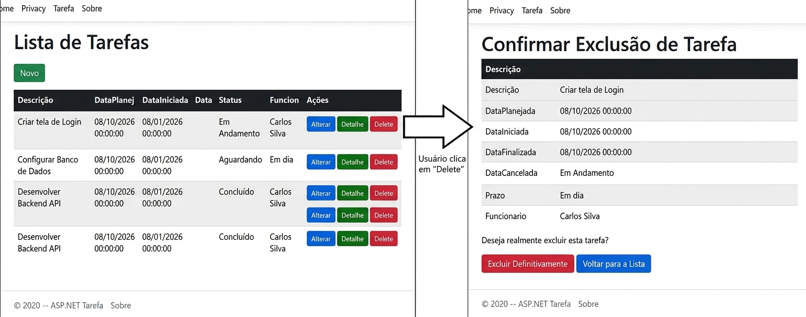
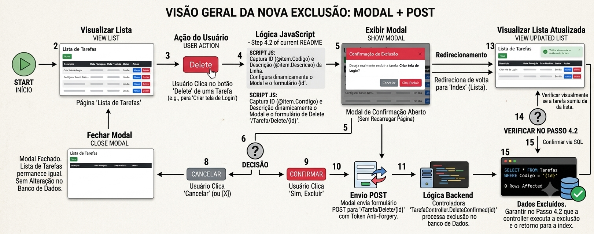
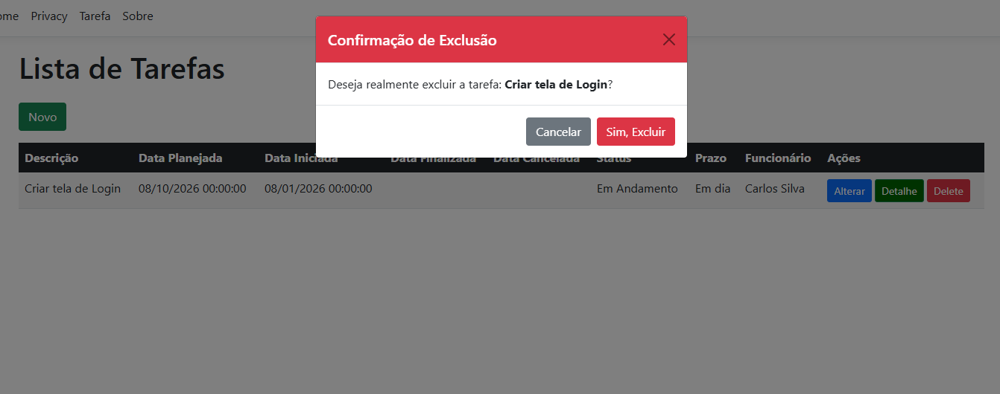
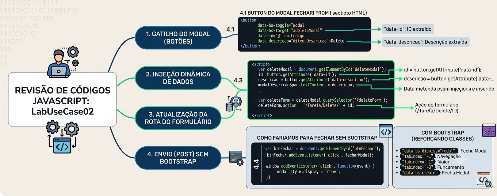
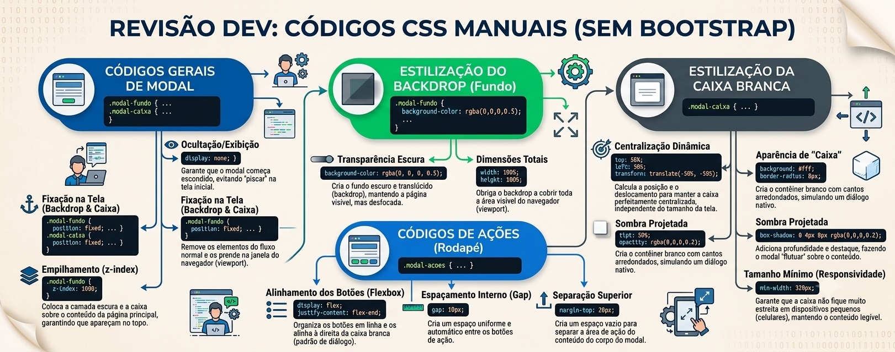

# LabUseCase02 - Refatoração do Front-end (HTML Puro & Bootstrap)

Seja bem-vindo ao LabUseCase02! Nesta aula prática, focaremos nos fundamentos do desenvolvimento web. Vamos abandonar os Tag Helpers automáticos do ASP.NET Core e trabalhar diretamente com HTML Puro, aplicando também o framework Bootstrap para estilizar a interface de forma profissional.

---

## 🚀 PREPRAÇÃO: Preparação do Banco de Dados Inicial

Só faça esse passo caso ainda não tenha o banco de dados dbTasks em seu computador.

1. Abra o **SQL Server Management Studio (SSMS)** ou o **Azure Data Studio**.
2. Conecte-se à sua instância local do SQL Server.
3. Execute o script SQL abaixo para criar o banco de dados `dbTasks` e as tabelas iniciais:

```sql
CREATE DATABASE dbTasks;
GO
USE dbTasks;
GO

-- Tabela Funcionario
CREATE TABLE Funcionario (
    Codigo INT IDENTITY(1,1) PRIMARY KEY,
    Nome VARCHAR(100) NOT NULL,
    Cargo VARCHAR(50) NOT NULL
);
GO

-- Tabela Tarefa
CREATE TABLE Tarefa (
    Codigo INT IDENTITY(1,1) PRIMARY KEY,
    Descricao VARCHAR(200) NOT NULL,
    DataPlanejada DATETIME NOT NULL,
    DataIniciada DATETIME NULL,
    DataFinalizada DATETIME NULL,
    DataCancelada DATETIME NULL,
    StatusTarefa VARCHAR(30) NOT NULL,
    Prazo VARCHAR(20) NOT NULL,
    FuncionarioId INT NOT NULL,
    CONSTRAINT FK_Tarefa_Funcionario FOREIGN KEY (FuncionarioId) 
        REFERENCES Funcionario(Codigo)
);
GO

-- Inserindo Dados Iniciais para Teste
INSERT INTO Funcionario (Nome, Cargo) VALUES 
('Carlos Silva', 'Desenvolvedor Senior'),
('Ana Oliveira', 'Analista de QA'),
('Roberto Santos', 'Gerente de Projetos');

INSERT INTO Tarefa (Descricao, DataPlanejada, DataIniciada, DataFinalizada, DataCancelada, StatusTarefa, Prazo, FuncionarioId) VALUES 
('Criar tela de Login', '2026-08-10', '2026-08-01', NULL, NULL, 'Em Andamento', 'Em dia', 1),
('Homologar Release 1.0', '2026-08-05', NULL, NULL, NULL, 'Pendente', 'Em atraso', 2);
GO
```

---

## 🛠️ Passo 1: Configuração da Nova Branch

Antes de colocar a mão no código, precisamos garantir que o projeto está organizado seguindo o fluxo de ramificações (GitFlow).
1. Certifique-se de que você está na sua branch principal de desenvolvimento (develop) atualizada.
2. Caso ainda não tenha feito o fork ou precise sincronizar sua base, garanta que seu repositório local esteja atualizado.
3. Crie e mude para uma nova branch específica para esta atividade chamada LabSofUseCase02-TaskFrontSemRazor.

---

## 📝 Passo 2: Migração do Front-end para HTML Puro

O ASP.NET MVC utiliza recursos do Razor (como asp-action e propriedades automáticas) para agilizar o desenvolvimento. Porém, entender como o HTML bruto se comunica com as rotas do servidor é essencial para qualquer desenvolvedor.

Abra o arquivo Views/Tarefa/Index.cshtml do seu projeto, substitua todo o conteúdo atual pelo código em HTML puro abaixo e salve o arquivo:


```html
@model IEnumerable<AppTask.Models.Tarefa>

@{
    ViewData["Title"] = "Index";
}

<h1>Index</h1>

<p>
    <a href="/Tarefa/Create">Create New</a>
</p>
<table class="table">
    <thead>
        <tr>
            <th>Descrição</th>
            <th>Data Planejada</th>
            <th>Data Iniciada</th>
            <th>Data Finalizada</th>
            <th>Data Cancelada</th>
            <th>Status da Tarefa</th>
            <th>Prazo</th>
            <th>Funcionário</th>
            <th></th>
        </tr>
    </thead>
    <tbody>
        @foreach (var item in Model) {
            <tr>
                <td>@item.Descricao</td>
                <td>@item.DataPlanejada</td>
                <td>@item.DataIniciada</td>
                <td>@item.DataFinalizada</td>
                <td>@item.DataCancelada</td>
                <td>@item.StatusTarefa</td>
                <td>@item.Prazo</td>
                <td>@item.Funcionario?.Nome</td>
                <td>
                    <a href="/Tarefa/Edit/@item.Codigo">Edit</a> |
                    <a href="/Tarefa/Details/@item.Codigo">Details</a> |
                    <a href="/Tarefa/Delete/@item.Codigo">Delete</a>
                </td>
            </tr>
        }
    </tbody>
</table>
```

---

## ⚡🎨 Passo 3: Customizando o Front-end com Bootstrap

Agora que a estrutura está em HTML puro, vamos aplicar classes de estilo do Bootstrap para transformar a tabela e os links em botões modernos e amigáveis.

Substitua novamente o conteúdo do arquivo Views/Tarefa/Index.cshtml pelo código estilizado abaixo:


```html
@model IEnumerable<AppTask.Models.Tarefa>

@{
    ViewData["Title"] = "Index";
}

<h1 class="mb-4">Lista de Tarefas</h1>

<p>
    <a href="/Tarefa/Create" class="btn btn-success text-white">Novo</a>
</p>

<table class="table table-striped table-hover">
    <thead class="table-dark">
        <tr>
            <th>Descrição</th>
            <th>Data Planejada</th>
            <th>Data Iniciada</th>
            <th>Data Finalizada</th>
            <th>Data Cancelada</th>
            <th>Status</th>
            <th>Prazo</th>
            <th>Funcionário</th>
            <th>Ações</th>
        </tr>
    </thead>
    <tbody>
        @foreach (var item in Model) {
            <tr>
                <td>@item.Descricao</td>
                <td>@item.DataPlanejada</td>
                <td>@item.DataIniciada</td>
                <td>@item.DataFinalizada</td>
                <td>@item.DataCancelada</td>
                <td>@item.StatusTarefa</td>
                <td>@item.Prazo</td>
                <td>@item.Funcionario?.Nome</td>
                <td>
                    <a href="/Tarefa/Edit/@item.Codigo" class="btn btn-primary btn-sm text-white">Alterar</a>
                    <a href="/Tarefa/Details/@item.Codigo" class="btn btn-success btn-sm text-white" style="background-color: #006400;">Detalhe</a>
                    <a href="/Tarefa/Delete/@item.Codigo" class="btn btn-danger btn-sm text-white">Delete</a>
                </td>
            </tr>
        }
    </tbody>
</table>

```

## 🗑️ Passo 4: Implementando a Confirmação de Exclusão com Modal do Bootstrap em TAREFA

Para melhorar a experiência do usuário, vamos substituir o redirecionamento para a página de Delete por uma caixa de diálogo elegante (Modal) utilizando os componentes nativos do Bootstrap.

Atualmente para excluir uma tarefa você clica em delete e ele envia para outra página.



Nosso objetivo é ao clicar em delete, ele abrir um modal e ao confirmar excluir o elemento


#### 4.1 Botão excluir - invocar modal

Substituia o código que está no botão delete para ficar assim.

```html
 <button type="button" class="btn btn-danger btn-sm text-white" data-bs-toggle="modal" data-bs-target="#deleteModal" data-id="@item.Codigo" data-descricao="@item.Descricao">
 Delete
</button>

```


#### 4.2 - Adicionando caixa de DIALOGO - MODAL
Vamos adicionar  o modal para ficar similar a imagem a seguir:




Adicione esse código na index de tarefa 

```html
<!-- Modal de Confirmação de Exclusão -->
<div class="modal fade" id="deleteModal" tabindex="-1" aria-labelledby="deleteModalLabel" aria-hidden="true">
    <div class="modal-dialog">
        <div class="modal-content">
            <div class="modal-header bg-danger text-white">
                <h5 class="modal-title" id="deleteModalLabel">Confirmação de Exclusão</h5>
                <button type="button" class="btn-close" data-bs-dismiss="modal" aria-label="Close"></button>
            </div>
            <div class="modal-body">
                Deseja realmente excluir a tarefa: <strong id="tarefaDescricao"></strong>?
            </div>
            <div class="modal-footer">
                <button type="button" class="modal-btn-cancel btn btn-secondary" data-bs-dismiss="modal">Cancelar</button>
                <!-- Formulário que dispara o POST de Delete para a Controller -->
                <form id="deleteForm" method="post" action="">
                    @Html.AntiForgeryToken()
                    <button type="submit" class="btn btn-danger">Sim, Excluir</button>
                </form>
            </div>
        </div>
    </div>
</div>

```

Rode sua aplicação. Ao tentar rodar agora ele exibe O MODAL, mas se confirmar não vai funcionar. Para que funcione iremos para o proximo passo, que é JavaScript


#### 4.3 Script do modal

No final agora do seu arquivo index.cshtml de tarefa adicione o código a seguir  e teste a exclusão.

```html
@section Scripts {
    <script>
        // Script para capturar os dados da linha da tabela e injetar no Modal dinamicamente
        var deleteModal = document.getElementById('deleteModal');
        deleteModal.addEventListener('show.bs.modal', function (event) {
            var button = event.relatedTarget; // Botão que acionou o modal
            var id = button.getAttribute('data-id'); // Extrai o ID
            var descricao = button.getAttribute('data-descricao'); // Extrai a descrição

            // Atualiza o texto da descrição no corpo do modal
            var modalDescricaoSpan = deleteModal.querySelector('#tarefaDescricao');
            modalDescricaoSpan.textContent = descricao;

            // Altera o atributo 'action' do formulário interno para apontar para a rota correta de delete
            var deleteForm = deleteModal.querySelector('#deleteForm');
            deleteForm.action = '/Tarefa/Delete/' + id;
        });
    </script>
}


```


#### 4.4 Sem o Bootstrap como seria  (Não precisa colar no seu projeto)

Sem o bootstrap para implementar as funcionaliades/ações no modal seria preciso usar recursos nativos do JS.

Nesse cenario a comunicação vai funcionar assim e você poderá ver no código a seguir.

- Gatilho (abrirModal): Ao clicar no botão Delete de qualquer linha da tabela, o JS extrai o data-id e o data-descricao.

- Injeção da Rota: O JS altera o atributo action do formulário <form id="deleteForm"> definindo o endereço correto da Controller, como /Tarefa/Delete/1.

- Envio (POST): Ao clicar no botão Sim, Excluir, o formulário HTML faz uma requisição POST nativa do navegador para a Controller, enviando junto o token de segurança @Html.AntiForgeryToken().


 Veja agora o código


```html
<!-- Estilo Mínimo Nativo -->
<style>
    /* Fundo escuro translúcido (Backdrop) */
    .modal-fundo {
        display: none; /* Inicia oculto */
        position: fixed;
        top: 0; left: 0;
        width: 100%; height: 100%;
        background-color: rgba(0, 0, 0, 0.5);
        z-index: 1000;
    }

    /* Caixa do Modal */
    .modal-caixa {
        position: fixed;
        top: 50%; left: 50%;
        transform: translate(-50%, -50%);
        background: #fff;
        padding: 20px;
        border-radius: 8px;
        box-shadow: 0 4px 8px rgba(0,0,0,0.2);
        min-width: 320px;
    }

    .modal-acoes {
        display: flex;
        justify-content: flex-end;
        gap: 10px;
        margin-top: 20px;
    }
</style>

<!-- Exemplo de Tabela com Botão Excluir Nativo -->
<table>
    <tr>
        <td>Criar tela de Login</td>
        <td>
            <button type="button" class="btn-delete" data-id="1" data-descricao="Criar tela de Login">
                Delete
            </button>
        </td>
    </tr>
</table>

<!-- Estrutura do Modal -->
<div id="meuModal" class="modal-fundo">
    <div class="modal-caixa">
        <h3>Confirmação de Exclusão</h3>
        <p>Deseja realmente excluir a tarefa: <strong id="tarefaDescricao"></strong>?</p>
        
        <div class="modal-acoes">
            <!-- Botão de Fechar Nativo -->
            <button type="button" id="btnFechar">Cancelar</button>

            <!-- Formulário HTML que dispara o POST para a Controller -->
            <form id="deleteForm" method="post" action="">
                @Html.AntiForgeryToken()
                <button type="submit">Sim, Excluir</button>
            </form>
        </div>
    </div>
</div>

<!-- Script Puro (Zero Bibliotecas) -->
<script>
    var modal = document.getElementById('meuModal');
    var btnFechar = document.getElementById('btnFechar');
    var deleteForm = document.getElementById('deleteForm');
    var modalDescricaoSpan = document.getElementById('tarefaDescricao');

    // 1. Função manual para ABRIR o modal e injetar os dados da tarefa
    function abrirModal(id, descricao) {
        // Atualiza a descrição na tela
        modalDescricaoSpan.textContent = descricao;

        // Configura a rota de envio da controller dinamicamente (ex: /Tarefa/Delete/1)
        deleteForm.action = '/Tarefa/Delete/' + id;

        // Exibe o modal
        modal.style.display = 'block';
    }

    // 2. Função manual para FECHAR o modal
    function fecharModal() {
        modal.style.display = 'none';
    }

    // 3. Captura o clique em qualquer botão "Delete" da tabela
    document.querySelectorAll('.btn-delete').forEach(function(button) {
        button.addEventListener('click', function() {
            var id = this.getAttribute('data-id');
            var descricao = this.getAttribute('data-descricao');
            abrirModal(id, descricao);
        });
    });

    // 4. Evento de clique no botão Cancelar
    btnFechar.addEventListener('click', fecharModal);

    // 5. Fechar ao clicar no fundo escuro translúcido
    window.addEventListener('click', function(event) {
        if (event.target === modal) {
            fecharModal();
        }
    });
</script>


```


### 4.5 Conhecendo as classes Bootstrap (Reforçando)

| Classe / Atributo HTML | Função / O que ele faz |
| :--- | :--- |
| `class="modal fade"` | Transforma a <div> em uma janela flutuante e aplica a animação suave de transição (fade-in/fade-out). |
| `tabindex="-1"` | Desativa a navegação normal por Tab na página e prende o foco dentro da janela do Modal. |
| `aria-labelledby="deleteModalLabel"` | Recursos de acessibilidade (Screen Readers): conecta o container do Modal ao seu título principal. |
| `aria-hidden="true"` | Mantém a janela oculta para leitores de tela enquanto o Modal não for ativado. |
| `class="modal-dialog"` | Controla as dimensões, margens e centralização da caixa de diálogo na tela. |
| `class="modal-content"` | Renderiza o contêiner interno com fundo branco, cantos arredondados e sombra projetada. |
| `class="modal-header bg-danger text-white"` | Define o topo do Modal estilizado em vermelho (bg-danger) com texto em branco. |
| `class="modal-body"` | Espaço reservado para a mensagem principal de confirmação apresentada ao usuário.|
| `class="modal-footer"` | Área reservada para o agrupamento de ações e botões no rodapé da janela.|
| `data-bs-dismiss="modal"` | Atributo JavaScript nativo do Bootstrap que fecha o Modal imediatamente ao ser clicado. |
| `data-bs-toggle="modal"` | Define a intenção do botão de disparar a abertura de um elemento do tipo Modal. |
 `data-bs-target="#deleteModal"` | Aponta exatamente qual Modal (pelo id) deve ser aberto ao clicar no botão.. |


## ➕ Passo 5: Refatorando o Create de Tarefa

Neste passo, vamos refatorar a View de criação (`Views/Tarefa/Create.cshtml`). Substituiremos os Tag Helpers do ASP.NET (`asp-action`, `asp-for`, `asp-items`) por **HTML Puro** utilizando atributos nativos (`action`, `method`, `name`, `id`), mantendo a integração correta com a Controller através dos nomes das propriedades e da `@Html.AntiForgeryToken()`.

Abra o arquivo `Views/Tarefa/Create.cshtml`, substitua todo o seu conteúdo pelo código abaixo e salve:

```html
@model AppTask.Models.Tarefa

@{
    ViewData["Title"] = "Nova Tarefa";
}

<h1 class="mb-4">Cadastrar Nova Tarefa</h1>

<div class="row">
    <div class="col-md-6">
        <form action="/Tarefa/Create" method="post">
            @Html.AntiForgeryToken()

            <div class="mb-3">
                <label for="Descricao" class="form-label font-weight-bold">Descrição</label>
                <input type="text" id="Descricao" name="Descricao" class="form-control" placeholder="Digite a descrição da tarefa" required />
            </div>

            <div class="mb-3">
                <label for="DataPlanejada" class="form-label">Data Planejada</label>
                <input type="datetime-local" id="DataPlanejada" name="DataPlanejada" class="form-control" required />
            </div>

            <div class="mb-3">
                <label for="DataIniciada" class="form-label">Data Iniciada</label>
                <input type="datetime-local" id="DataIniciada" name="DataIniciada" class="form-control" />
            </div>

            <div class="mb-3">
                <label for="DataFinalizada" class="form-label">Data Finalizada</label>
                <input type="datetime-local" id="DataFinalizada" name="DataFinalizada" class="form-control" />
            </div>

            <div class="mb-3">
                <label for="DataCancelada" class="form-label">Data Cancelada</label>
                <input type="datetime-local" id="DataCancelada" name="DataCancelada" class="form-control" />
            </div>

            <div class="mb-3">
                <label for="StatusTarefa" class="form-label">Status da Tarefa</label>
                <select id="StatusTarefa" name="StatusTarefa" class="form-select" required>
                    <option value="">-- Selecione o Status --</option>
                    <option value="Pendente">Pendente</option>
                    <option value="Em Andamento">Em Andamento</option>
                    <option value="Concluído">Concluído</option>
                    <option value="Cancelado">Cancelado</option>
                </select>
            </div>

            <div class="mb-3">
                <label for="Prazo" class="form-label">Prazo</label>
                <input type="text" id="Prazo" name="Prazo" class="form-control" placeholder="Ex: Em dia, Em atraso" required />
            </div>

            <div class="mb-3">
                <label for="FuncionarioId" class="form-label">Funcionário Responsável</label>
                <select id="FuncionarioId" name="FuncionarioId" class="form-select" required>
                    <option value="">-- Selecione um Funcionário --</option>
                    @if (ViewBag.ListaFuncionario != null)
                    {
                        foreach (var item in (IEnumerable<SelectListItem>)ViewBag.ListaFuncionario)
                        {
                            <option value="@item.Value">@item.Text</option>
                        }
                    }
                </select>
            </div>

            <div class="mb-3 d-flex gap-2">
                <button type="submit" class="btn btn-primary">Salvar Tarefa</button>
                <a href="/Tarefa/Index" class="btn btn-secondary">Voltar para a Lista</a>
            </div>
        </form>
    </div>
</div>
```

Principais Mudanças Aplicadas no HTML Puro
- Envio de Formulário: Substituição de asp-action="Create" por action="/Tarefa/Create" method="post" acompanhado do @Html.AntiForgeryToken().

- Mapeamento do Model: Troca de asp-for="Propriedade" por atributos nativos id="Propriedade" e name="Propriedade". O ASP.NET Binder utiliza o atributo name para mapear os dados diretamente no objeto da Controller.

- Select do Funcionário: Substituição do asp-items por um loop @foreach manual iterando sobre a coleção (IEnumerable<SelectListItem>)ViewBag.ListaFuncionario.

- Inputs Específicos: Definição do atributo type="datetime-local" nos campos de data para habilitar o seletor nativo de data e hora do navegador.


## ➕➕ Passo 6: Refatorando Funcionario, Incidente, Departamento e CentralDeCusto

Usando a mesma estratégia praticado nos passos anteriroes. Faça a refatoraçao dos arquivos 'index' e 'create' dos fluxos de Funcionario, Incidente, Departamento e CentralDeCusto.


Para cada fluxo sempre crie um branch nova e depois de testar faça o merge com develop.


## Resumo (Infográfico)

Códigos Javascript



Revisão CSS



## Informação Extra - JS e JQuery

Você pode deixar seu código front end 100% sem uso de razor você pode usar o JS com Jquery. É comum encontra essa estrutura em aplicações que já estão em produção há um tempo.

Veja como ficaria o seu código de Index Tarefa.

HTML
```html
<h1>Index</h1>

<p>
    <a href="/Tarefa/Create">Create New</a>
</p>
<table class="table">
    <thead>
        <tr>
            <th>Descrição</th>
            <th>Data Planejada</th>
            <th>Data Iniciada</th>
            <th>Data Finalizada</th>
            <th>Data Cancelada</th>
            <th>Status da Tarefa</th>
            <th>Prazo</th>
            <th>Funcionário</th>
            <th></th>
        </tr>
    </thead>
    <tbody id="tabela-tarefas">
        <!-- O conteúdo será gerado via JS -->
    </tbody>
</table>

````

E agora o JS com Jquery

```html
<script>
$(document).ready(function () {
    // Busca os dados da controller (Endpoint JSON)
    $.ajax({
        url: '/Tarefa/ObterTodas', // Ajuste para a sua rota de API/Controller
        type: 'GET',
        dataType: 'json',
        success: function (data) {
            let linhas = '';

            $.each(data, function (index, item) {
                // Trata propriedades nulas ou não formatadas
                let funcionarioNome = item.funcionario ? item.funcionario.nome : '';
                let dataPlanejada = item.dataPlanejada ? new Date(item.dataPlanejada).toLocaleDateString() : '';
                let dataIniciada = item.dataIniciada ? new Date(item.dataIniciada).toLocaleDateString() : '';
                let dataFinalizada = item.dataFinalizada ? new Date(item.dataFinalizada).toLocaleDateString() : '';
                let dataCancelada = item.dataCancelada ? new Date(item.dataCancelada).toLocaleDateString() : '';

                linhas += `
                    <tr>
                        <td>${item.descricao || ''}</td>
                        <td>${dataPlanejada}</td>
                        <td>${dataIniciada}</td>
                        <td>${dataFinalizada}</td>
                        <td>${dataCancelada}</td>
                        <td>${item.statusTarefa || ''}</td>
                        <td>${item.prazo || ''}</td>
                        <td>${funcionarioNome}</td>
                        <td>
                            <a href="/Tarefa/Edit/${item.codigo}">Edit</a> |
                            <a href="/Tarefa/Details/${item.codigo}">Details</a> |
                            <a href="/Tarefa/Delete/${item.codigo}">Delete</a>
                        </td>
                    </tr>
                `;
            });

            // Insere as linhas geradas na tabela
            $('#tabela-tarefas').html(linhas);
        },
        error: function (error) {
            console.error('Erro ao carregar tarefas:', error);
        }
    });
});
</script>

````

