# 🚀 Guia Prático: SISTEMA CLINICA MÉDIA - AGENDAMENTO CONSULTA

## 📌 Contexto do Projeto: Sistema de Gestão da Clínica Médica "Vida & Saúde"


A clínica médica "Vida & Saúde" precisa informatizar o atendimento de consultas para melhorar a organização da agenda diária. Atualmente, os pacientes ligam ou vão presencialmente à recepção para marcar horários com médicos de diversas especialidades.

No sistema, um Paciente cadastra seus dados pessoais (Nome, CPF, Telefone e Data de Nascimento). O Médico possui seu cadastro contendo Nome, CRM e Especialidade. Uma Consulta representa o agendamento em si, onde é registrado o Paciente, o Médico responsável, a Data/Hora agendada e o Status do atendimento (Ex: Agendada, Realizada, Cancelada).

O paciente só consegue fazer agendamento  se estiver logado.  Ao abrir o sistema a primeira tela é a de login, que deve conter abaixo também uma opção para a pessoa fazer o cadastro, caso ainda não tenha.


---

## 🛠️ Pré-requisitos
- Visual Studio 2022 (com suporte ao .NET 9 instado)
- Microsoft SQL Server e SQL Server Management Studio (SSMS)

---

## 🗄️ Etapa 1: levantamento de Requisitos Funcionais

Os requisitos funcionais estão atrelada ao negócio do usuário. Um exemplo, usuário só pode fazer agendmaento se estiver logado. Cada paciente só pode fazer um agendamento naquele dia.

os requisitos funcionais são diferente dos requisitos não funcionais, pois os não funcionais refere-se, por exemplo, a definição de qual banco de dados usar, ou linguagem de programação.

Então, com base em nosso contexto podemos definir a list a seguir como nossa lista inicial de requisitos funcionais.

| ID | Requisito | Descrição |
| :--- | :--- | :--- |
| **R1** | Cadastro de Pacientes | O sistema deve permitir cadastrar, visualizar, atualizar e excluir (CRUD) os dados dos pacientes. |
| **R2** | Cadastro de Médicos | O sistema deve permitir cadastrar, visualizar, atualizar e excluir (CRUD) os dados dos médicos (incluindo CRM e Especialidade). |
| **R3** | Agendamento de Consulta | O sistema deve permitir agendar consultas vinculando obrigatoriamente 1 Paciente e 1 Médico a uma data/hora específica. |
| **R4** | Controle de Status | Toda consulta deve iniciar com o status "Agendada", permitindo alteração para "Realizada" ou "Cancelada". |
| **R5** | Integridade Relacional | Não deve ser possível excluir um paciente ou médico que já possua consultas vinculadas no histórico. |


## 🗄️ Etapa 2: DER - DIGRAMA DE ENTIDADE E RELACIONAMENTO

Com base no contexto  e requisitos podemos considerar a  imagem a seguir (DER) como ponto de partida para implementar nosso sistema.

  

ATENÇÃO
No mercado do trabalho o imporante é focar no pedido solicitado. Se um gestor pede para implementar o DER acima, foque nessa entrega. Não é interessante criar outras tabelas e campos sem antes alinhar com a sua supervisão.


Para crair o banco de dados você pode fazer via Script, ou via interface do SQL Server Management.

Vamos fazer usando a proposta de intereface (cliques, tela).

1. Abra o **SQL Server Management** e coloque as credencias de login e senha
2. Ao lado esquerdo para criar o banco de dados clique com o botão direito em Banco de Dados e em seguida **Novo Banco de Dados**


3. Defina o nome do banco de dados para **dbClinica** e depois confirme clicando em **ok**


4. Para verificar se o banco foi criado, expanda a visualização de banco clicando no sinal de + de banco de dados a esquerda e se ainda não apareceu clique no botão atualizar (azul)


5. Para criar as tabelas vamos usar a opção visual **Criar Diagrama de Banco de Dados**. Clique com o botão direito nessa opção estando na visualiação do banco **dbClinica** e em seguida clique em **Novo Diagrama de Banco de Dados**


Atenção, se aparecer alguma mensagem pode confirmar **Sim**, ou ok. Também, deve aparecer uma tela para adicionar tabelas, mas como ainda não existe tabelas criadas estará vazias. Basta clicar em fechar.

6. Para criar uma nova tabela clique com o botão direito em qualquer  lugar e clique em **Nova Tabela**. Em seguda vamos nomear essa tabela como **Paciente**

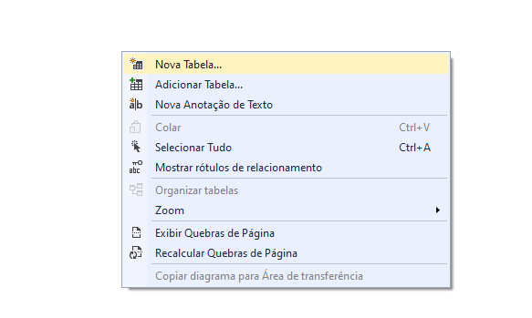

Nomei para paciente

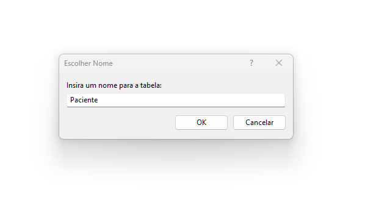

7. Defina os nomes dos campos e seus tipos conforme imagem a seguir e que foi baseada no DER.

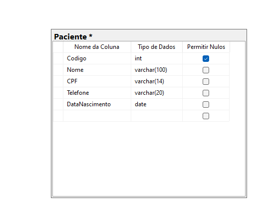

Observe que todos os campos são obrigatório, por isso  **Permitir Nulos** está desmarcado para ele. No entanto, para o campo Codigo ele está marcado. Não se preocupe, por que esse campo iremos gerar o código de forma automatica e sequencial. Sendo assim, ele nunca ficará nulo.


Atenção
Importante você salvar as alterações clicando em Salvar ("disquete"). Como é a primeira vez será solicitado o nome que vocÊ quer ofertar ao Diagrama, coloque **DER Clinica**.

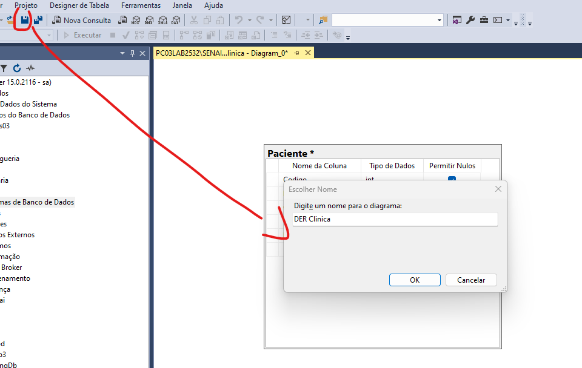

8. Chave Primária. O campo codigo conforme contexto e DER será nossa chave primária e para garantir sistemáticamente que ele não se repita, clique com o botão direito em cima de **codigo** e em seguida clique em **Definir Chave Primária**


ATENÇÃO
!Ops. Se depois que você clicar em salvar, aparecer uma janela de alerta...

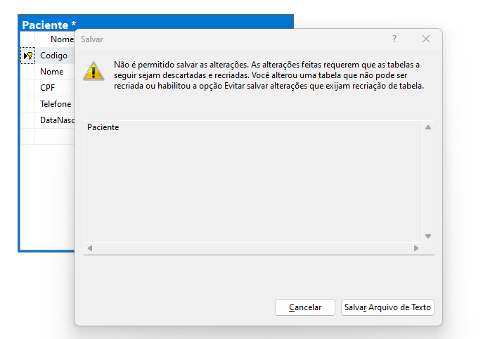


 informando que não é possível salvar alterações. Faça as seguintes etapas.

  8.2. Clique em ferramentas, opções. Na janela que for abertar clique na opção **Designers** e desmarque as opções de aviso e confirme. 
  Clique novamente em salvar e vefique se o projeto foi salvo.

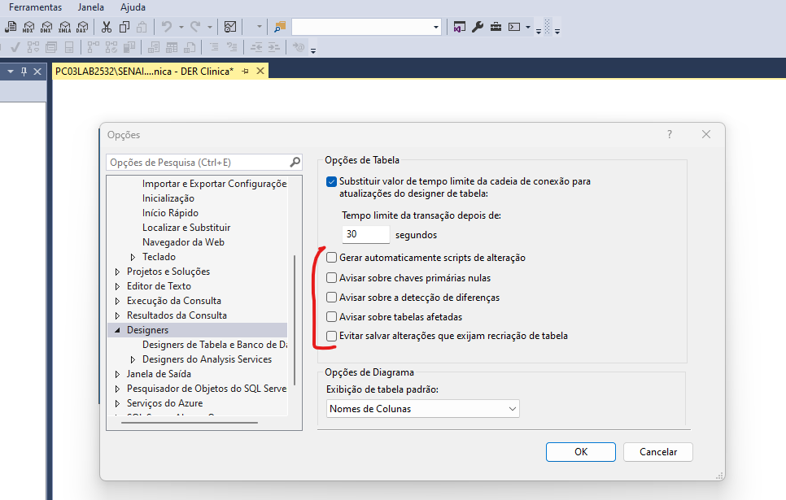

Observe que a chave amarela vai esta ao lado de código e o asterisco ao lado do nome Paciente também sumiu confirmando que todas as alterações foram salvas.

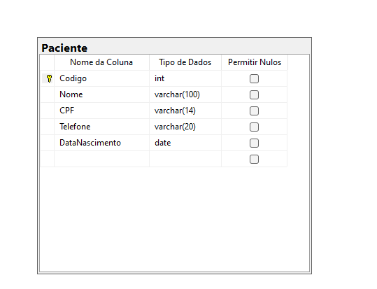


9. Código automático. Para que o código do Paciente seja inserido numeração automática. Você deve clicar com o botão direito em **Codigo** e em seguida, clica em **Propriedade**. Nas opções que abrir na parte direita da tela deixe as opções a seguir marcado com Sim e valor 1

  - Especificação de Identidade = Sim
    - (É identidade) = Sim
    - Incremento de Identidade = 1
    - Semente de Identidade = 1

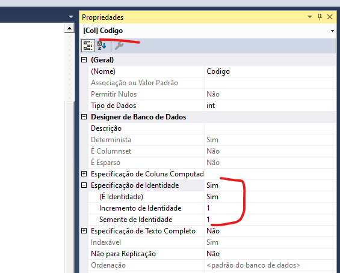


10. Crie a tabela Medico e Consulta seguindo os passos feito para criarmos paciente.

- ATENÇÃO!

A tabela Consulta vai ter o campo PacienteID e MedicoID esses campos são do tipo inteiro e será passado manualmente. Não colocar identação.
Quanto a forma de vincular esse campo a suas tabelas de origem (PacienteID com Codigo na taela Paciente) será mostrado no próximo passo.

Depois de finalizado o seu digrama deve ficar similar a imagem abaixo:


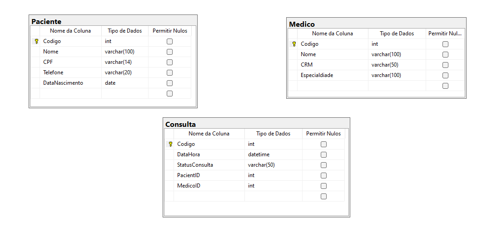

11. Integridade Referencia - Chave estrangeira

O fato de você ter criado a tabela consulta com o campo PacienteId e colocar do tipo inteiro, não é o bastante para evitar, por exemplo, que um usuário colque um PacienteID com valor 100 e na tabela Paciente esse código não existir. Já imaginou na hora da consulta informar um código de paciente que não existe na tabela Paciente? Como resolver?

Para resolver isso, vamos informar que o campo PacientID é uma chave estrangeira do campo Codigo na tabela Paciente.

- Passo para ligar Codigo do Paciente a PacientID
  Clique em cima da chave amarela ao lado do Codigo na tabela Paciente, seguro e arraste e solte em cima do campo PacientID na tabela Consulta.

  Na janela que aparecer confirme que na esquerda (chave primária) está a tabela Paciente e o campo Codigo. Na parte da direita  (chave estrangeira) a tabela Consulta e o campo PacienteID

  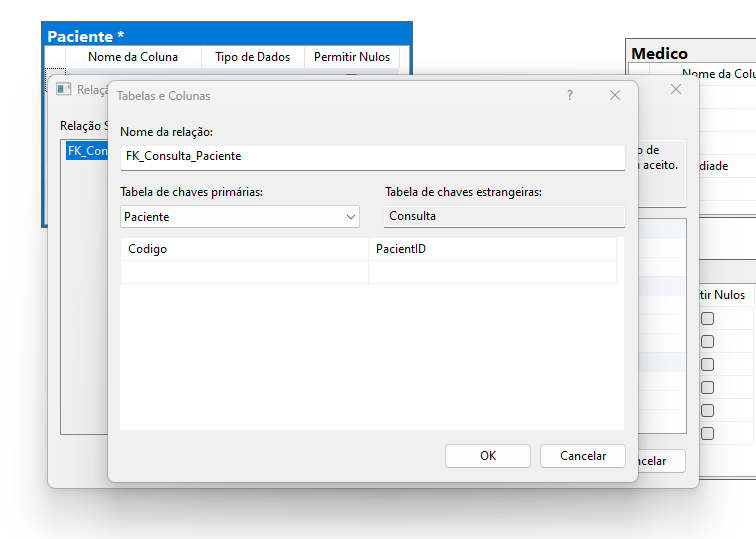

   Faça o mesmo processo para vincular o  Codigo do Médido  na tabela Médico com o campo MedicoID na tabela consulta


  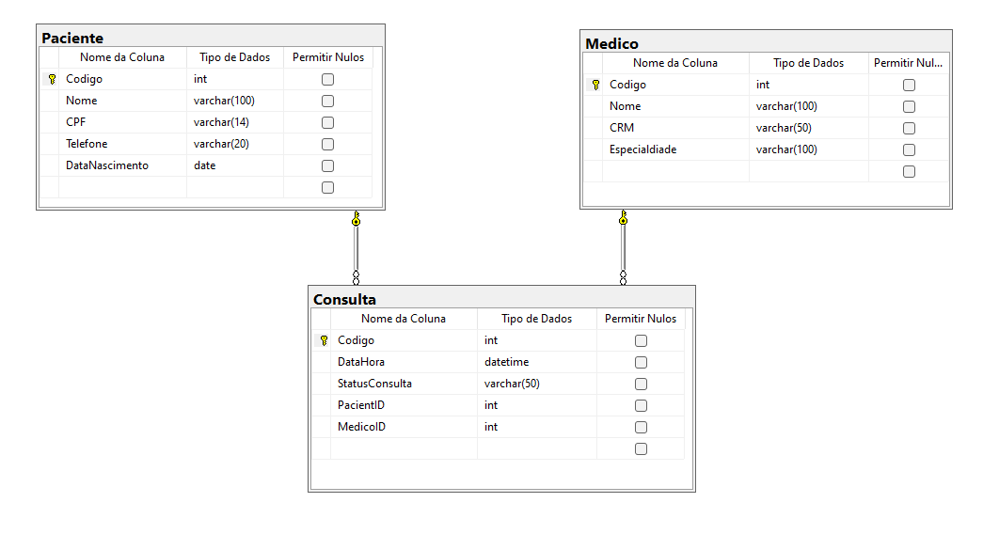


  Atenção! Sempre vá salvando as alterações


## 🗄️ Etapa 2B: CRIAÇAO DO BANCO DE DADOS COM SCRIPT


Se você quiser pode rodar o script a seguir e ele irá criar o banco de dados e as tabelas com seus campos e relacionamento. E ainda, via insert vai inserir alguns dados.


```sql
CREATE DATABASE dbClinica;
GO
USE dbClinica;
GO

-- Tabela Paciente
CREATE TABLE Paciente (
    Codigo INT IDENTITY(1,1) PRIMARY KEY,
    Nome VARCHAR(100) NOT NULL,
    Cpf VARCHAR(14) NOT NULL UNIQUE,
    Telefone VARCHAR(20) NOT NULL,
    DataNascimento DATE NOT NULL
);
GO

-- Tabela Medico
CREATE TABLE Medico (
    Codigo INT IDENTITY(1,1) PRIMARY KEY,
    Nome VARCHAR(100) NOT NULL,
    Crm VARCHAR(20) NOT NULL UNIQUE,
    Especialidade VARCHAR(50) NOT NULL
);
GO

-- Tabela Consulta
CREATE TABLE Consulta (
    Codigo INT IDENTITY(1,1) PRIMARY KEY,
    DataHora DATETIME NOT NULL,
    StatusConsulta VARCHAR(30) NOT NULL,
    PacienteId INT NOT NULL,
    MedicoId INT NOT NULL,
    CONSTRAINT FK_Consulta_Paciente FOREIGN KEY (PacienteId) 
        REFERENCES Paciente(Codigo),
    CONSTRAINT FK_Consulta_Medico FOREIGN KEY (MedicoId) 
        REFERENCES Medico(Codigo)
);
GO

-- Inserindo Dados Iniciais para Teste
INSERT INTO Paciente (Nome, Cpf, Telefone, DataNascimento) VALUES 
('Maria Oliveira', '111.222.333-44', '(11) 98888-7777', '1990-05-15'),
('João Souza', '555.666.777-88', '(11) 97777-6666', '1985-10-20');

INSERT INTO Medico (Nome, Crm, Especialidade) VALUES 
('Dra. Helena Rios', 'CRM/SP 123456', 'Cardiologia'),
('Dr. Roberto Alves', 'CRM/SP 654321', 'Ortopedia');

INSERT INTO Consulta (DataHora, StatusConsulta, PacienteId, MedicoId) VALUES 
('2026-10-15 14:00:00', 'Agendada', 1, 1),
('2026-10-16 09:30:00', 'Agendada', 2, 2);
GO
```

### 📁 Importação de dados via Arquivo

Se você quiser, você pode importar os dados de 5 pacientes diretamente do arquivo **pacientes.csv** disponibilizado.

Siga os passos a seguir

1. Clique com o botão direito do mouse em seu banco de dados, depois escolha Tarefa e em seguidda Importar Dados.
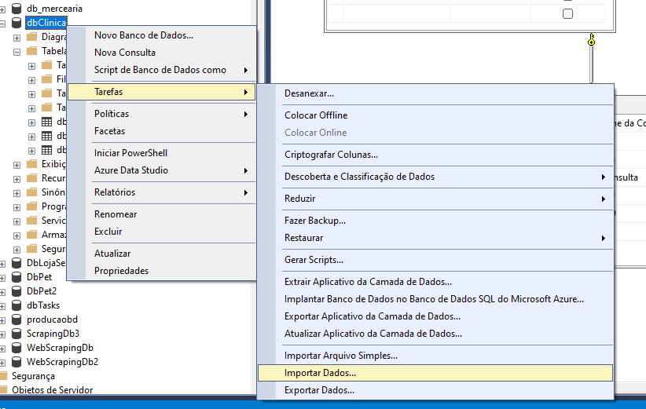

2. Clique em avançar e na tela seguinte escolha:
  - Fonte de dados: Flat File Source
  - Nome do arquivo: clique em procurar, localize o arquivo **pacienres.csv** (se nao exibir mesmo estando na pasta, coloque a opção como todos os arquivos ao lado do nome)
  - clique em próximo
  
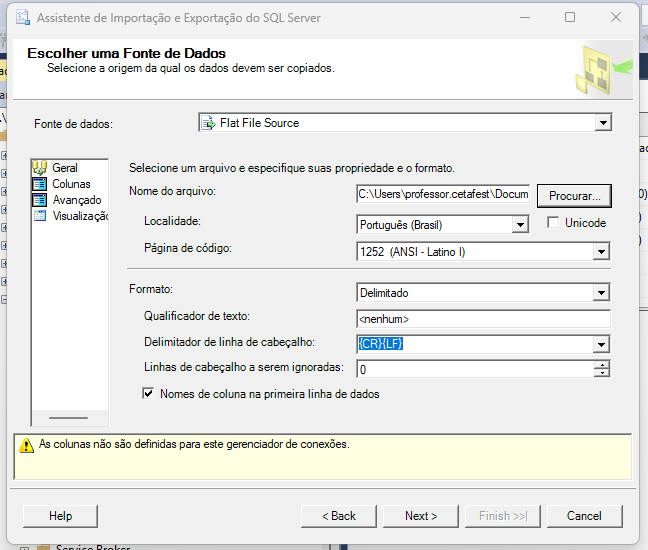

3. Verifique se os dados estão organizados, o delimitado nesse caso é vírgula.

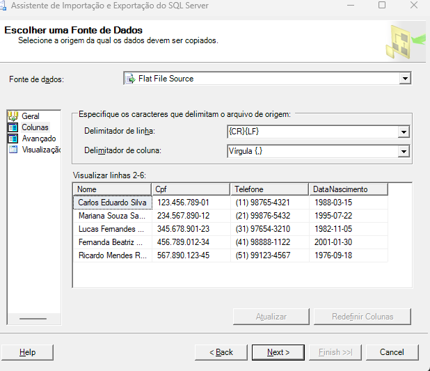

4. Destino
   - escolha **Microsoft OLE DB Provider for SQL Server**
   - nome do servidor: **.\SENAI**
   - marque a opção: **Usar autenticação do SQL Server**
   - usuário: **sa** ou seu usuário
   - senha: **coloque a senha do seu sql**
   - banco de dados: **dbClinica**

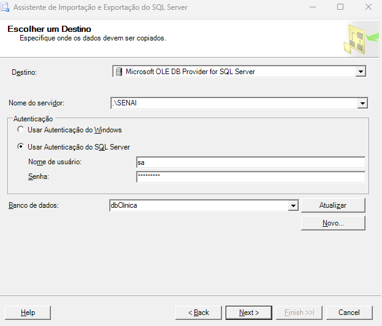

Ele já vai sugerir a tabela paciente, você pode alterar se desejar, ou caso não esteja correto.

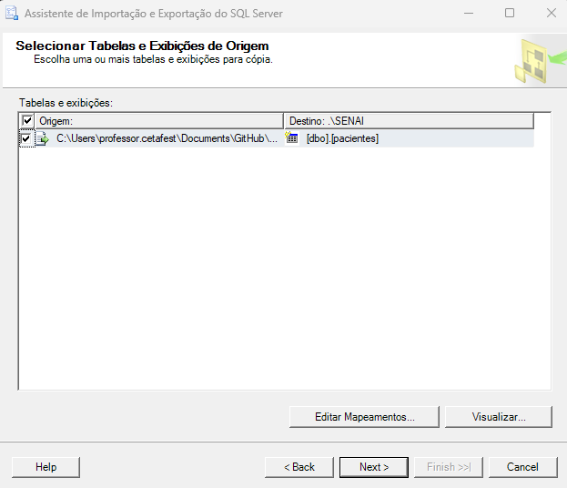

Pode ir avançando e confirmar.

Estando tudo certo se você usar o comando na consutla sql

```sql
select * from paciente
```

Irá retornar os pacientes.

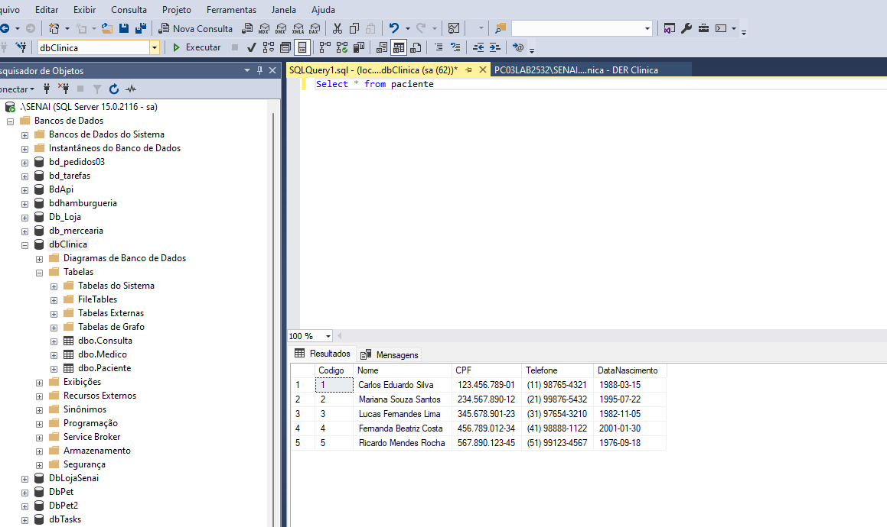


### 📁 Criação do Projeto no Visual Studio


Com nosso Banco de dados prontos, agora é a hora de criarmos o nosso preto no ASP.NET (Visual Studio)


## 📦 Etapa 1: Criando O projeto ASP.NET

- Abre o Visual Studio.

- Clique em Criar um novo projeto.

- Selecione o modelo Web do ASP.NET Core (Model-View-Controller) e clique em Próximo.

- Defina o nome da solução (ex: appReversotask) e clique em Próximo.

- Selecione o Framework .NET 7.0 (Suporte Técnico Padrão) e clique em Criar.


## 📦 Etapa 2: Instalação dos Pacotes do Entity Framework

- Microsoft.EntityFrameworkCore.SqlServer

- Microsoft.EntityFrameworkCore.Tools

- Microsoft.VisualStudio.Web.CodeGeneration.Design

Para instalar você deve usar o Gerianciador de Pacote Nuget, cliando com o botão direito do mouse no nome do projeto e clicando em **Gerenciar Pacotes Nuget**.

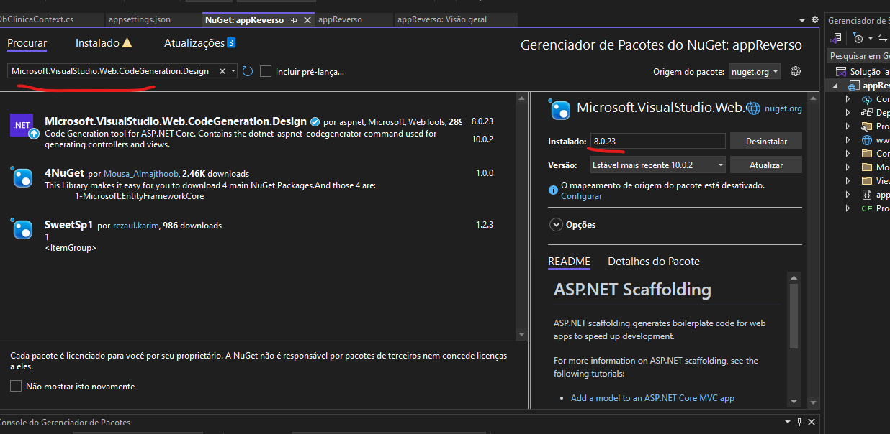

A versão do pacote deve ser a mesma da versão .NET de seu projeto. Se no passo **Etapa 01 - criando o projeto ASP.NET** você escolheu 7.0 
, na versão do pacote escolha a  maior versão da 7.. exemplo 7.x.x


## ⚙️ Etapa 3: Configuração da String de Conexão no appsettings.json

Abra o arquivo appsettings.json na raiz do projeto e configure a propriedade ConnectionStrings.

```json
{
  "Logging": {
    "LogLevel": {
      "Default": "Information",
      "Microsoft.AspNetCore": "Warning"
    }
  },
  "AllowedHosts": "*",
  "ConnectionStrings": {
    "ConexaoSqlServer": "Server=.\\SENAI; Database=dbClinica; User Id=sa; Password=senai.123; TrustServerCertificate=True;"
  }
}
```

Exemplo com Autenticação do Windows (Trusted Connection)

```json
"ConnectionStrings": {
  "ConexaoSqlServer": "Server=\\SENAI; Database=dbClinica; Trusted_Connection=True; TrustServerCertificate=True;"
}
```


## 🔨 Etapa 4: Engenharia Reversa - scaffolding update database

Você deve abrir o **Console do Gerenciador de Pacotes** para executar o comando a seguir. 

Ele irá fazer o mapeamento das tabelas e automaticamente irá crir a classe de contexto, que é responsável pelo 
mapeamento das tabelas do banco em classses.

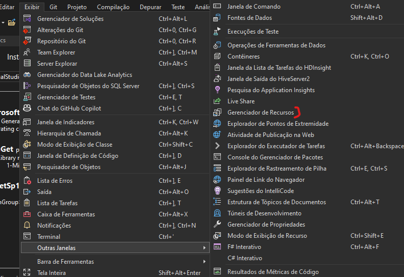

Comando

```json

Scaffold-DbContext "Name=ConexaoSqlServer" Microsoft.EntityFrameworkCore.SqlServer -OutputDir Models -Force

```

Observe também se dentro da pasta Models foi criado para cada tabela uma classe.
Também, verifique qual o nome que foi dado a classe de Contexto, provalvelmente será DbClincaContext, mas pode ser outro nome. Procure a classe que tenha o sufixo a **context.**, vai ser ela.


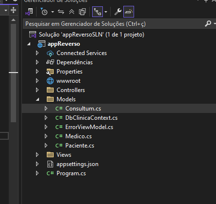

Verifique se alguma classe (paciente, medico, consulta) ficou com o nome diferente, se sim, faça a alteração do nome para igualar ao da tabela.

No caso da imagem acima, ao invés de **Consulta** foi criado **Consultum** . Altere o nome do arquivo da classe. Você também deve alterar o nome dentro da Classe DbClinicaContext. Resumo onde estiver **Consultum** alterar para **Consulta**.


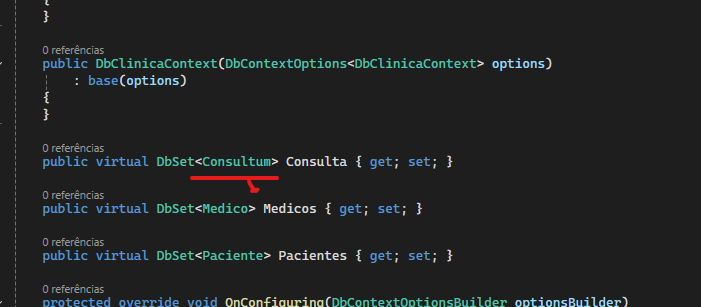


## 🔨 Etapa 5: Compilação Obrigatória da Solução
Antes de gerar as telas e controllers, o projeto precisa estar limpo e compilado:

- Pressione Ctrl + Shift + B ou clique com o botão direito na Solução e selecione Recompilar (Rebuild).


## Etapa 6: Registro do DbContext na Injeção de Dependência (Program.cs)

Para que o gerador de código consiga instanciar o banco sem erros de tempo de execução ou na geração do Scaffolding, registre o contexto no contêiner de dependências do .NET.

Abra o arquivo Program.cs e insira o registro antes do var app = builder.Build();:

```c#
using Microsoft.EntityFrameworkCore;
using appReverso.Models; // Subsitua pelo namespace real das suas Models

var builder = WebApplication.CreateBuilder(args);

// Adicionar os serviços ao contêiner
builder.Services.AddControllersWithViews();

// Registrando o DbContext com a String de Conexão
builder.Services.AddDbContext<DbClinicaContext>(options =>
    options.UseSqlServer(builder.Configuration.GetConnectionString("ConexaoSqlServer")));

var app = builder.Build();
```


## 🎨 Etapa 7: Gerando o CRUD Automático (Scaffolding MVC)

Agora vamos criar os **Controllers** e **Views Razor** sem digitar nenhuma linha de código manual:

1. No **Gerenciador de Soluções**, clique com o botão direito na pasta `Controllers` > **Adicionar** > **Item do Scaffolding...** (ou *New Scaffolded Item...*).
2. Selecione a opção **Controlador MVC com exibições, usando o Entity Framework** e clique em **Adicionar**.
3. Na janela de configuração:
   - **Classe de modelo:** Selecione `Paciente (appReverso.Models)`.
   - **Classe do contexto de dados:** Selecione `DbClinicaContext (appReverso.Models)`.
   - **Exibições:** Certifique-se de que a opção de gerar views esteja marcada.
4. Clique em **Adicionar**.
5. Repita o mesmo procedimento para a classe de modelo `Medico` e `Consulta`.

**ATENÇÃO**
Deixe os nomes da controller no Singular

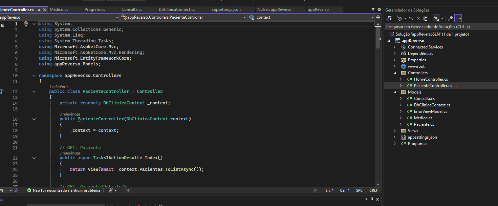


## 🎯 Resultado Esperado
O Visual Studio gerará automaticamente:

- PacinteController.cs com as ações de Create, Read, Update, Delete (CRUD) prontas.

- As pastas Views/Paciente com os arquivos .cshtml correspondentes (Index, Create, Edit, Details, Delete).

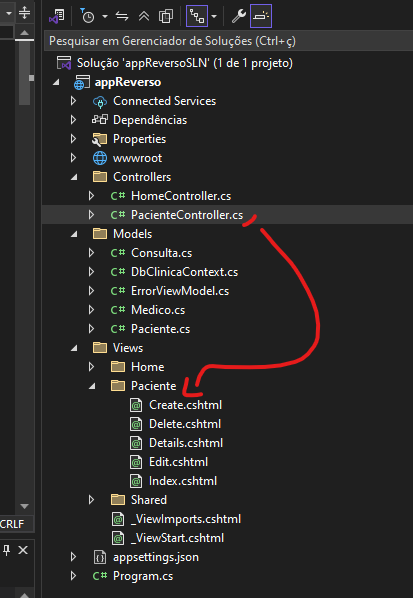

Basta pressionar F5 para executar a aplicação e navegar até /Paciente para visualizar seu CRUD totalmente funcional conectado ao banco SQL Server! 🚀

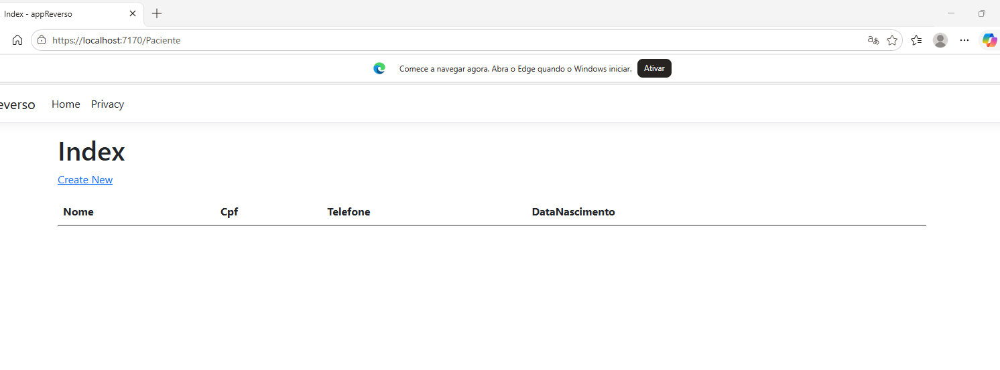

Repita o mesmo processo para Medico e Consulta

## 🔒 Implementando Autenticação Simples com Session

Para nível de treinamento vamos criar uma estrutura de autenticação login, usando sessões.

### 1. Criando a View Model de Login

Dentro da pasta `Models`, crie uma nova classe chamada `LoginViewModel.cs`. Ela servirá para capturar os dados do formulário de login.

```csharp
using System.ComponentModel.DataAnnotations;

namespace appReverso.Models
{
    public class LoginViewModel
    {
        [Required(ErrorMessage = "O CPF é obrigatório.")]
        [Display(Name = "CPF do Paciente")]
        public string Cpf { get; set; } = string.Empty;
    }
}

### 2. Criar Controller de Login

Clique com o botão direito na pasta Controllers > Adicionar > Controlador... > Escolha Controlador MVC - Vazio e nomeie como AccountController.cs.

Adicione o código abaixo para gerenciar o Login e o Logout do paciente:

```csharp
using appReverso.Models;
using Microsoft.AspNetCore.Mvc;
using Microsoft.EntityFrameworkCore;


namespace appReverso.Controllers
{
    public class AccountController : Controller
    {
        private readonly DbClinicaContext _context;

        public AccountController(DbClinicaContext context)
        {
            _context = context;
        }

        [HttpGet]
        public IActionResult Login() => View();


        [HttpPost]
        public async Task<IActionResult> Login(LoginViewModel model)
        {
            if (!ModelState.IsValid) return View(model);

            var paciente = await _context.Pacientes
                .FirstOrDefaultAsync(p => p.Cpf == model.Cpf);

            if (paciente == null)
            {
                ModelState.AddModelError("", "CPF não encontrado.");
                return View(model);
            }

            // Salva na Session
            HttpContext.Session.SetInt32("PacienteId", paciente.Codigo);
            HttpContext.Session.SetString("PacienteNome", paciente.Nome);

            return RedirectToAction("Index", "Consulta");
        }

        public IActionResult Logout()
        {
            HttpContext.Session.Clear(); // Limpa a sessão
            return RedirectToAction("Login");
        }

    }
}

A proposta aqui é que toda vez que o Login for válido, o CPF ele adicionar uma sessão no navegaor e salva o código e nome do paciente.

```
### 3. Criar a ViewLogin

  1. Dentro da pasta Views, crie uma nova pasta chamada Account.
  2. Dentro de Views/Account, crie um arquivo Razor View chamado Login.cshtml com o seguinte conteúdo:

```html
@model appReverso.Models.LoginViewModel

@{
    ViewData["Title"] = "Login";
}

<div class="col-md-4 mx-auto mt-4">
    <h3 class="text-center">Acesso do Paciente</h3>

    <form asp-action="Login" method="post">
        <div asp-validation-summary="ModelOnly" class="text-danger"></div>

        <div class="mb-3">
            <label asp-for="Cpf" class="form-label"></label>
            <input asp-for="Cpf" class="form-control" placeholder="111.222.333-44" />
            <span asp-validation-for="Cpf" class="text-danger"></span>
        </div>

        <button type="submit" class="btn btn-primary w-100 mb-2">Entrar</button>
    </form>

    <div class="text-center">
        <a asp-controller="Paciente" asp-action="Create">Criar cadastro</a>
    </div>
</div>

@section Scripts {
    @{
        await Html.RenderPartialAsync("_ValidationScriptsPartial");
    }
}

```

### 4. Ative a Session no  programa.cs

```csharp
// 1. Adicionar o serviço de Session (antes do var app = builder.Build())
builder.Services.AddSession(options =>
{
    options.IdleTimeout = TimeSpan.FromMinutes(30);
    options.Cookie.HttpOnly = true;
    options.Cookie.IsEssential = true;
});


var app = builder.Build();

// 2. Ativar o Middleware de Session (depois do app.UseRouting())
app.UseRouting();
app.UseSession(); 
app.UseAuthorization();

```

### 5. Incluindo segurança em Consulta

Abra a ConsultaController.cs

Na Index (ou no formulário de agendamento), você faz a verificação direta na Session, exemplo:

```csharp
public async Task<IActionResult> Index()
{
    // Verifica se a sessão existe
    var pacienteId = HttpContext.Session.GetInt32("PacienteId");

    if (pacienteId == null)
    {
        // Se não estiver logado, redireciona para a tela de login
        return RedirectToAction("Login", "Account");
    }

    // Código normal da Index...
    var consultas = await _context.Consultas
        .Include(c => c.Medico)
        .Include(c => c.Paciente)
        .Where(c => c.PacienteId == pacienteId) // Mostra apenas as consultas do paciente logado!
        .ToListAsync();

    return View(consultas);
}

```


## 🔒 (Opcional) Implementando Autenticação com Cookies e Autorize no ASP.NET (O ideial)

Para atender ao requisito de negócio onde **o paciente só pode agendar consultas se estiver autenticado**, vamos criar um fluxo de login simplificado utilizando **Cookie Authentication** nativo do ASP.NET Core, onde o paciente se autentica informando apenas o seu **CPF**.

---

### 1. Criando a View Model de Login

Dentro da pasta `Models`, crie uma nova classe chamada `LoginViewModel.cs`. Ela servirá para capturar os dados do formulário de login.

```csharp
using System.ComponentModel.DataAnnotations;

namespace appReverso.Models
{
    public class LoginViewModel
    {
        [Required(ErrorMessage = "O CPF é obrigatório.")]
        [Display(Name = "CPF do Paciente")]
        public string Cpf { get; set; } = string.Empty;
    }
}

### 2. Criar Controller de Login

Clique com o botão direito na pasta Controllers > Adicionar > Controlador... > Escolha Controlador MVC - Vazio e nomeie como AccountController.cs.

Adicione o código abaixo para gerenciar o Login e o Logout do paciente:

```csharp

using Microsoft.AspNetCore.Authentication;
using Microsoft.AspNetCore.Authentication.Cookies;
using Microsoft.AspNetCore.Mvc;
using Microsoft.EntityFrameworkCore;
using System.Security.Claims;
using appReverso.Models;

namespace appReverso.Controllers
{
    public class AccountController : Controller
    {
        private readonly DbClinicaContext _context;

        public AccountController(DbClinicaContext context)
        {
            _context = context;
        }

        // GET: /Account/Login
        [HttpGet]
        public IActionResult Login()
        {
            if (User.Identity != null && User.Identity.IsAuthenticated)
            {
                return RedirectToAction("Index", "Consulta");
            }
            return View();
        }

        // POST: /Account/Login
        [HttpPost]
        [ValidateAntiForgeryToken]
        public async Task<IActionResult> Login(LoginViewModel model)
        {
            if (!ModelState.IsValid) return View(model);

            // Busca o paciente pelo CPF digitado
            var paciente = await _context.Pacientes
                .FirstOrDefaultAsync(p => p.Cpf == model.Cpf);

            if (paciente == null)
            {
                ModelState.AddModelError("", "CPF não encontrado. Faça seu cadastro primeiro.");
                return View(model);
            }

            // Criando os dados da sessão (Claims)
            var claims = new List<Claim>
            {
                new Claim(ClaimTypes.NameIdentifier, paciente.Codigo.ToString()),
                new Claim(ClaimTypes.Name, paciente.Nome),
                new Claim("CPF", paciente.Cpf)
            };

            var claimsIdentity = new ClaimsIdentity(claims, CookieAuthenticationDefaults.AuthenticationScheme);

            await HttpContext.SignInAsync(
                CookieAuthenticationDefaults.AuthenticationScheme,
                new ClaimsPrincipal(claimsIdentity));

            return RedirectToAction("Index", "Consulta");
        }

        // GET: /Account/Logout
        public async Task<IActionResult> Logout()
        {
            await HttpContext.SignOutAsync(CookieAuthenticationDefaults.AuthenticationScheme);
            return RedirectToAction("Login");
        }
    }
}


```

### 3. Criar a ViewLogin

  1. Dentro da pasta Views, crie uma nova pasta chamada Account.
  2. Dentro de Views/Account, crie um arquivo Razor View chamado Login.cshtml com o seguinte conteúdo:

  ```csharp
    @model appReverso.Models.LoginViewModel

    @{
        ViewData["Title"] = "Acesso ao Sistema";
    }

    <div class="row justify-content-center mt-5">
        <div class="col-md-4">
            <div class="card shadow-sm">
                <div class="card-header bg-primary text-white text-center">
                    <h4>Clínica Vida & Saúde</h4>
                    <small>Acesso do Paciente</small>
                </div>
                <div class="card-body">
                    <form asp-action="Login" method="post">
                        <div asp-validation-summary="ModelOnly" class="text-danger mb-3"></div>

                        <div class="form-group mb-3">
                            <label asp-for="Cpf" class="form-label"></label>
                            <input asp-for="Cpf" class="form-control" placeholder="Digite seu CPF (ex: 111.222.333-44)" />
                            <span asp-validation-for="Cpf" class="text-danger"></span>
                        </div>

                        <div class="d-grid gap-2">
                            <button type="submit" class="btn btn-primary">Entrar</button>
                        </div>
                    </form>
                </div>
                <div class="card-footer text-center">
                    <p class="mb-0">Ainda não tem cadastro?</p>
                    <a asp-controller="Paciente" asp-action="Create" class="btn btn-link">Cadastre-se aqui</a>
                </div>
            </div>
        </div>
    </div>

    @section Scripts {
        @{await Html.RenderPartialAsync("_ValidationScriptsPartial");}
    }


  ```

### 4. Configurando a Autenticação por Cookies no Program.cs

Abra o arquivo Program.cs e ative o serviço de autenticação por cookies.

Insira a configuração antes de var app = builder.Build();

```csharp

using Microsoft.AspNetCore.Authentication.Cookies;

// Configuração da Autenticação por Cookie
builder.Services.AddAuthentication(CookieAuthenticationDefaults.AuthenticationScheme)
    .AddCookie(options =>
    {
        options.LoginPath = "/Account/Login";
        options.AccessDeniedPath = "/Account/Login";
        options.ExpireTimeSpan = TimeSpan.FromMinutes(30);
    });

```

E ative os Middlewares de autenticação depois de app.UseRouting(); e antes de app.UseAuthorization();:

```csharp

app.UseRouting();

// ATENÇÃO: Add estas duas linhas nesta ordem exata
app.UseAuthentication(); 
app.UseAuthorization();

```

### 5. Protegendo as Rotas com o atributo [Authorize]

Agora que a infraestrutura de login está pronta, precisamos proteger a ConsultaController para proibir o acesso de pessoas não logadas.

Abra o arquivo Controllers/ConsultaController.cs e adicione o atributo [Authorize] acima da classe:

```csharp

using Microsoft.AspNetCore.Authorization;

namespace appReverso.Controllers
{
    [Authorize] // Impede o acesso de usuários não autenticados
    public class ConsultaController : Controller
    {
        // Métodos do controller mantidos...
    }
}

```

### 6. Atualizando o Layout da Aplicação (_Layout.cshtml)
Para que o usuário saiba quem está logado e consiga fazer o Logout, abra o arquivo Views/Shared/_Layout.cshtml e atualize a barra de navegação (<nav>):

```html
<ul class="navbar-nav ms-auto">
    @if (User.Identity != null && User.Identity.IsAuthenticated)
    {
        <li class="nav-item">
            <span class="nav-link text-dark">Olá, <strong>@User.Identity.Name</strong></span>
        </li>
        <li class="nav-item">
            <a class="nav-link text-danger" asp-controller="Account" asp-action="Logout">Sair</a>
        </li>
    }
    else
    {
        <li class="nav-item">
            <a class="nav-link text-primary" asp-controller="Account" asp-action="Login">Entrar</a>
        </li>
    }
</ul>

```

### 7. 🎯 Testando o Fluxo Completo

1. Execute a aplicação (F5).
2. Tente acessar a rota /Consulta. O ASP.NET Core irá redirecionar automaticamente para a tela de Login (/Account/Login).
3. Digite o CPF de teste cadastrado no script SQL: 111.222.333-44 e clique em Entrar.
4. Você será autenticado e redirecionado para a tela de agendamento de consultas!
5. Se digitar um CPF inexistente, o sistema informará que o cadastro não foi encontrado e oferecerá o link de cadastro de novo paciente.

